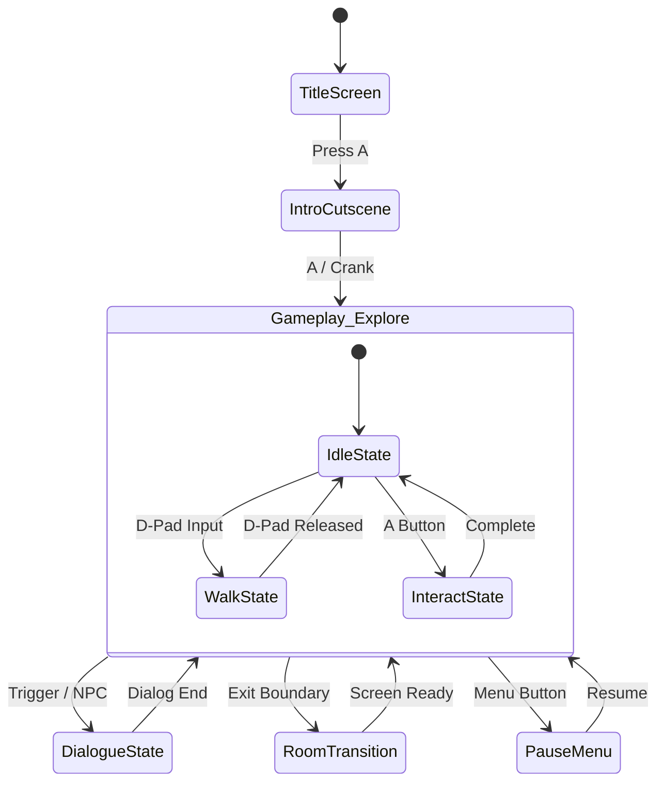

# Game Design Document (GDD)

**Project:** *s'ok-b'wrong*  
**Platform:** Panic Playdate  
**Target SDK:** Playdate SDK (Lua / C)  
**Visual Style:** 1-Bit Monochrome (400 × 240 px, 30 FPS)  
**Perspective:** Top-Down 2D  

---

## 1. System Architecture & Constraints

### 1.1 Display & Rendering
* **Screen Resolution:** 400 × 240 pixels (Physical 1-bit memory LCD).
* **Color Depth:** 1-bit (`#000000` Black, `#FFFFFF` White).
* **Target Framerate:** 30 FPS (or 50 FPS for high-speed responsiveness).
* **Transparency & Shading:** 8×8 dither matrices (`playdate.graphics.image.kColorDitherType`), black/white stencil masks, or 1-bit alpha channel cutout.
* **Drawing Optimization:** Screen redraw updates should utilize dirty rectangles (`setClipRect` / sprite dirty tracking) to maximize battery and CPU efficiency.

### 1.2 Grid & Tile Metric
* **Base Grid Unit:** 20 × 20 pixels.
  * Screen width: 400 / 20 = **20 tiles horizontally**.
  * Screen height: 240 / 20 = **12 tiles vertically**.
* **Sprite Dimensions:** 20 × 20 px base footprint (can scale to 20×40 or multi-tile bosses/hazards).

---

## 2. Core Game Loop & Architecture

### 2.1 State Management (Finite State Machine)


* **Game Controller FSM:** Handles global states (`TITLE`, `EXPLORE`, `DIALOGUE`, `INVENTORY`, `PAUSE`, `GAMEOVER`).
* **Actor FSM:** Handles local entity state transitions (`IDLE`, `WALK`, `INTERACT`, `STUN`, `ACTION`).

### 2.2 Physics & Collision
* **Movement Mode:** Tile-snapped or sub-pixel free roam with AABB (Axis-Aligned Bounding Box).
* **Collision Detection:** 
  * Static terrain: Tilemap collision layers using `playdate.graphics.sprite.addEmptyCollisionSprite()`.
  * Dynamic collisions: `playdate.graphics.sprite:moveWithCollisions(x, y)` utilizing `slide`, `freeze`, or `overlap` response types.
* **Camera System:** Static single-screen room flipping (20×12 grid per room). Screen transitions via instant cut, horizontal/vertical slide, or black circular dither wipes.

---

## 3. Input & Control Mapping

| Input Source | Primary Action | Secondary / Context Action |
| :--- | :--- | :--- |
| **D-Pad** | 4-Way / 8-Way planar movement (X/Y axis) | Menu selection navigation |
| **A Button** | Primary interaction / Talk / Confirm | Action execution |
| **B Button** | Cancel / Back / Dash / State negation | Secondary tool toggle |
| **Crank** | **Analog variable injection** (0°–359°) | Delta tracking (`getCrankChange()`) for tuning, steering, winding, or time-dilation |
| **Crank Dock/Undock** | State change trigger (`crankDocked` / `crankUndocked`) | Equipping / stowing crank-activated mechanical items |

---

## 4. Animation & Art Rigging

All sprites strictly adhere to low frame counts and clean 1-bit silhouette legibility:

```
+---------------+---------------+---------------+
|  Frame 1:     |  Frame 2:     |  Frame 3:     |
|  Contact      |  Passing      |  Contact      |
|  (Left Foot)  |  (Neutral)    |  (Right Foot) |
+---------------+---------------+---------------+
```

* **`idle_state`**: 2 frames (looping, subtle 1px breath/bob, ~2–4 FPS playback).
* **`walk_state`**: 3 frames (looping, contact $\rightarrow$ passing $\rightarrow$ contact, ~6–8 FPS playback).
* **`interact_state`**: 2 frames (non-looping, anticipation $\rightarrow$ strike/reach).

---

## 5. Asset Manifest

### 5.1 Sprites (`/images/sprites/`)
* `player_base-table-20-20.png` (Idle, Walk, Interact frames)
* `npc_archetype-table-20-20.png`
* `dynamic_hazard-table-20-20.png`
* `interactive_trigger-table-20-20.png`

### 5.2 Tilemaps (`/images/tiles/`)
* `world_tileset-table-20-20.png`:
  * `floor_navigable`
  * `wall_impassable`
  * `environment_decoration`

### 5.3 UI & System Graphics (`/images/ui/`)
* `dialogue_box.png` (9-slice resizable panel or 360×60 fixed banner)
* `input_prompts-table-16-16.png` (A, B, D-Pad, Crank indicator)
* `dither_masks.png`
